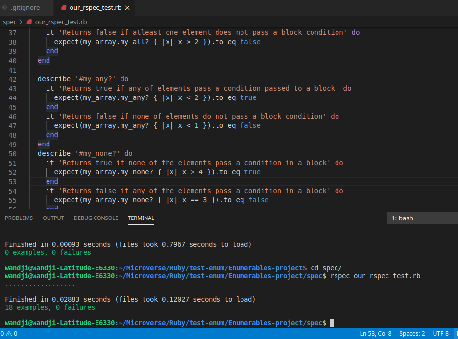

# Testing Enumerables

## RSspec

In this project we created test for both positive and negative examples for previously created Enumerable methods

**\_Below are a list of methods we made test for.**

- my_each
- my_each_with_index
- my_select
- my_all?
- my_any?
- my_none?
- my_count
- my_map
- my_inject

Getting Started
To get a local copy of the repository please run the following commands on your terminal:

$ cd <folder>
$ git clone https://github.com/elisha2kyakpo1/Enumerables-project.git
$ checkout to test-rspec-elisha/wandji
$ cd <spec>
$ run rspec our_rspec_test.rb

## Built With

- Ruby
- VScode
- rspec

## Authors

👤 **Elisha Kyakopo**

- GitHub: [@elisha2kyakpo1](https://github.com/elisha2kyakpo1)
- LinkedIn: [LinkedIn](https://www.linkedin.com/in/elisha-kyakopo-009aa3197/)

👤 **Angel Barros**

- GitHub: [@wandji20](https://github.com/wandji20)
- LinkedIn: [@wandjibertrand]

## 🤝 Contributing

Contributions, issues, and feature requests are welcome!

## Show your support

Give a ⭐️ if you like this project!
